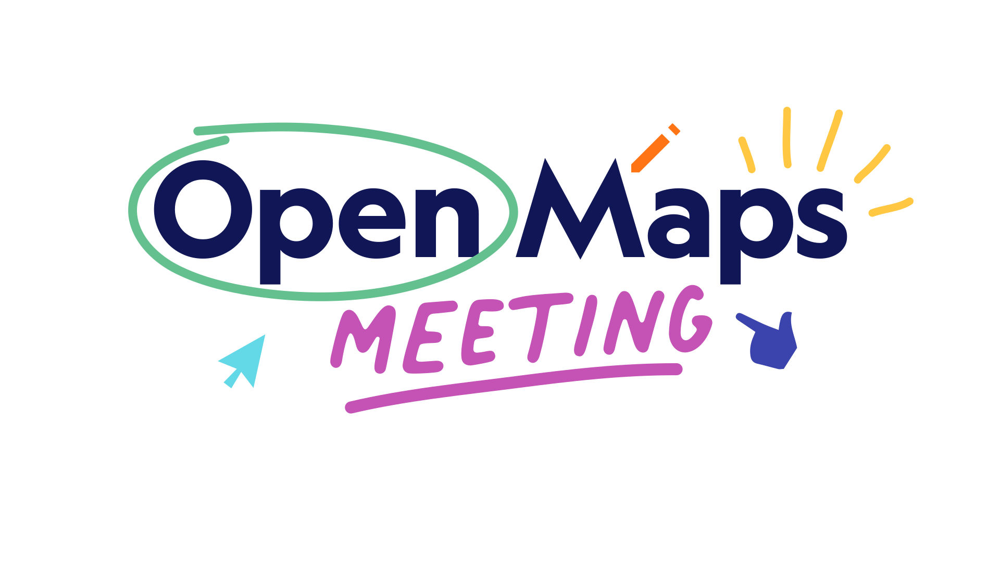

  <h2>The Open Maps Meeting brings together an international community of geospatial researchers, map curators, open-source developers and other professionals with a love for open data and historical maps</h2>
  
November 5 & 6 2024 at the Dutch National Archives and National Library 
  Organized by Jules Schoonman and Vincent Baptist (TU Delft)
  

  <a href="/introduction">Introduction↗︎</a>
  <a href="/programme">Programme↗︎</a>
  <a href="/practical">Practical information↗︎</a>
  <a href="/register">Register↗︎</a>

  

  

  

